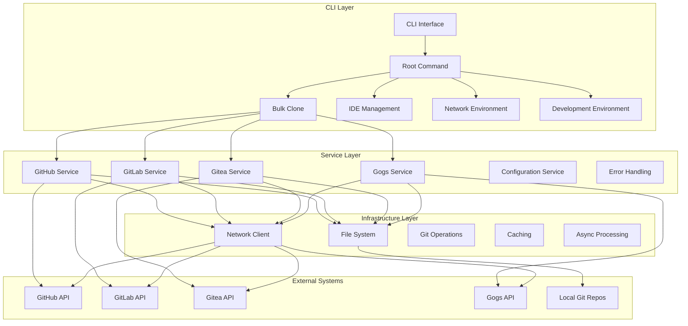
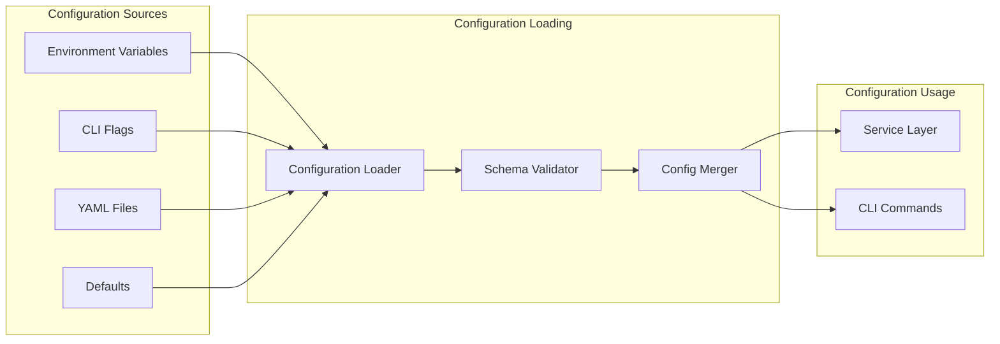
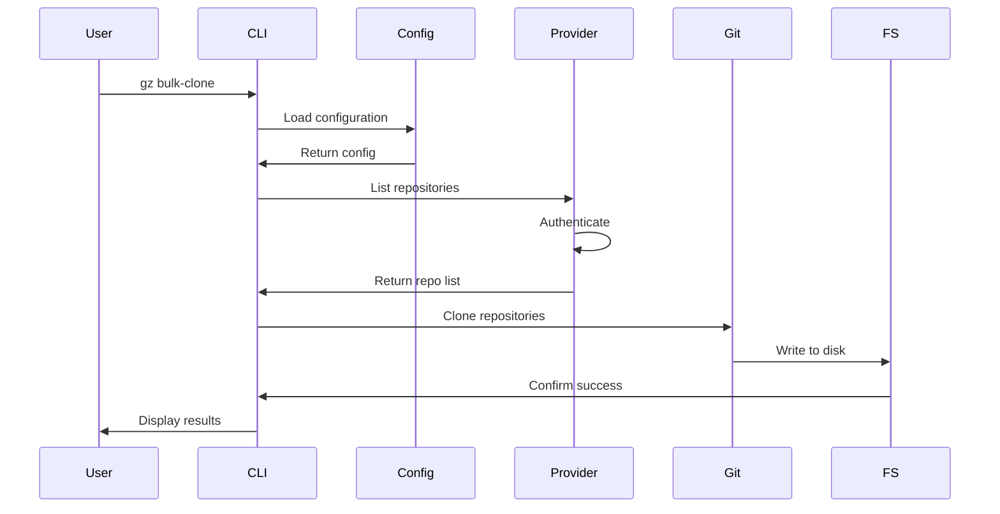
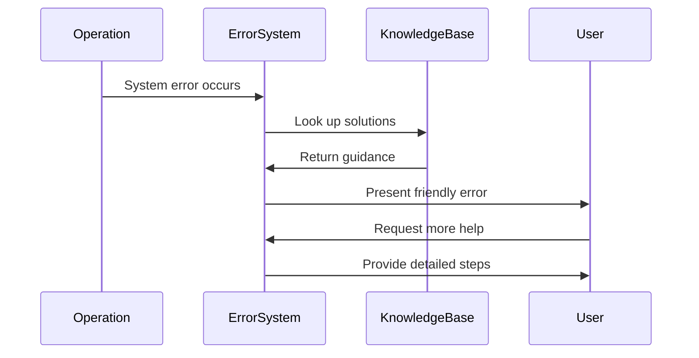
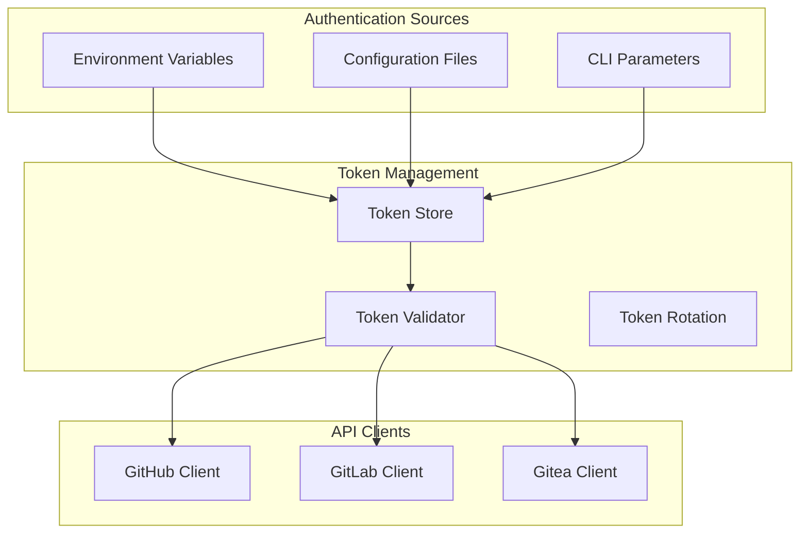
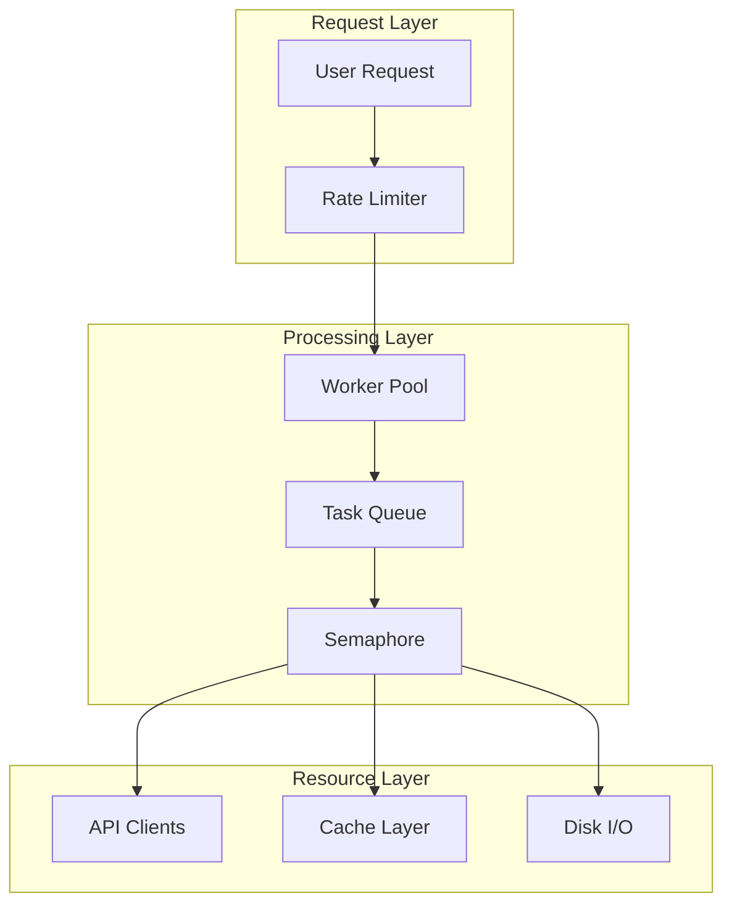
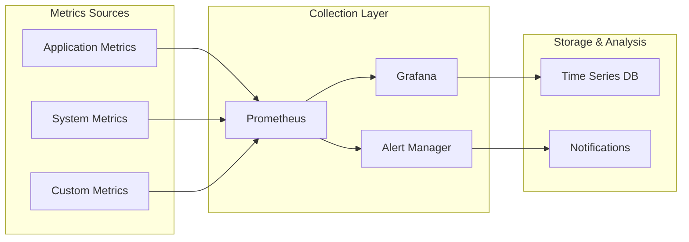
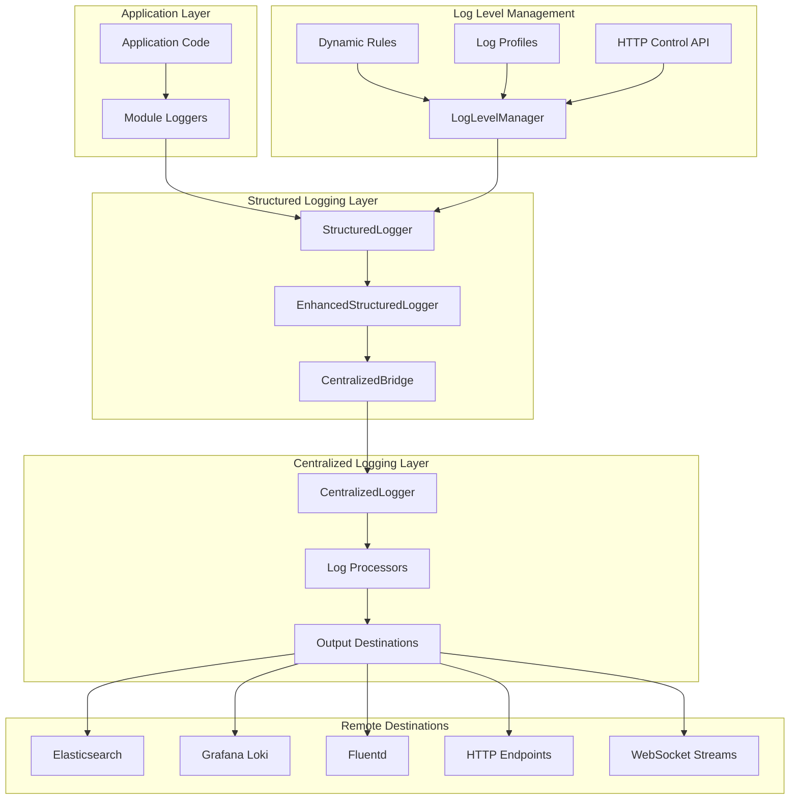

# GZH Manager Architecture Documentation

## Overview

GZH Manager (`gz`) is a comprehensive CLI tool designed for managing development environments and Git repositories across multiple platforms. This document provides a high-level architectural overview of the system design, components, and their interactions.

## Table of Contents

- [System Architecture](#system-architecture)
- [Component Overview](#component-overview)
- [Package Structure](#package-structure)
- [Design Patterns](#design-patterns)
- [Data Flow](#data-flow)
- [Extension Points](#extension-points)
- [Security Architecture](#security-architecture)
- [Performance Considerations](#performance-considerations)

## System Architecture



## Component Overview

### 1. CLI Layer (`cmd/`)

The CLI layer provides the user interface and command-line interface functionality:

- **Root Command**: Main entry point that coordinates all sub-commands
- **Bulk Clone**: Multi-platform repository cloning operations
- **IDE Management**: JetBrains IDE settings synchronization
- **Network Environment**: Network configuration and VPN management
- **Development Environment**: Development tool and environment management

### 2. Service Layer (`pkg/`)

The service layer contains business logic and provider-specific implementations:

- **Git Platform Services**: GitHub, GitLab, Gitea, Gogs integrations
- **Configuration Management**: YAML configuration loading and validation
- **Error Handling**: User-friendly error processing and recovery guidance
- **Async Processing**: Background tasks and concurrent operations
- **Caching**: Performance optimization through intelligent caching

### 3. Infrastructure Layer (`internal/`)

The infrastructure layer provides core utilities and abstractions:

- **File System Operations**: File and directory management
- **HTTP Client**: Network communication abstraction
- **Git Operations**: Git command execution and repository management
- **Testing Utilities**: Test helpers and mock services
- **Utilities**: Common functionality and helper functions

## Package Structure

### Core Packages

```
gzh-cli/
├── cmd/                    # CLI commands and user interface
│   ├── root.go            # Main CLI entry point
│   ├── bulk-clone/        # Repository bulk cloning
│   ├── ide/              # IDE management
│   ├── net-env/          # Network environment
│   └── dev-env/          # Development environment
├── pkg/                   # Public packages (importable)
│   ├── github/           # GitHub API integration
│   ├── gitlab/           # GitLab API integration
│   ├── gitea/            # Gitea API integration
│   ├── bulk-clone/       # Configuration and orchestration
│   ├── errors/           # Error handling and user guidance
│   ├── async/            # Asynchronous processing
│   ├── cache/            # Caching implementations
│   ├── memory/           # Memory management
│   └── recovery/         # Error recovery mechanisms
└── internal/             # Private packages
    ├── filesystem/       # File system abstraction
    ├── httpclient/       # HTTP client abstraction
    ├── git/              # Git operations
    ├── testlib/          # Testing infrastructure
    └── utils/            # Common utilities
```

### Configuration Architecture



## Design Patterns

### 1. Factory Pattern

Used for creating provider-specific clients and services:

```go
// Factory creates provider-specific implementations
type GitProviderFactory interface {
    CreateGitHubClient(config GitHubConfig) GitHubService
    CreateGitLabClient(config GitLabConfig) GitLabService
    CreateGiteaClient(config GiteaConfig) GiteaService
}
```

### 2. Strategy Pattern

Implemented for different cloning strategies:

```go
type CloneStrategy interface {
    Execute(ctx context.Context, repo Repository, target string) error
}

// Strategies: reset, pull, fetch
type ResetStrategy struct{}
type PullStrategy struct{}
type FetchStrategy struct{}
```

### 3. Observer Pattern

Used in the event system:

```go
type EventBus interface {
    Subscribe(eventType string, handler EventHandler)
    Publish(event Event)
}
```

### 4. Builder Pattern

Applied in configuration building and error construction:

```go
type ErrorBuilder interface {
    Message(string) ErrorBuilder
    Description(string) ErrorBuilder
    Suggest(string) ErrorBuilder
    Build() *UserError
}
```

### 5. Facade Pattern

Provides simplified interfaces for complex subsystems:

```go
type BulkCloneFacade interface {
    CloneOrganizations(ctx context.Context, config BulkCloneConfig) error
    ValidateConfiguration(config BulkCloneConfig) error
    GetProgress() ProgressInfo
}
```

## Data Flow

### Repository Cloning Flow



### Error Handling Flow



## Extension Points

### 1. Git Provider Extensions

Add support for new Git hosting services:

```go
type GitProvider interface {
    GetDefaultBranch(ctx context.Context, org, repo string) (string, error)
    List(ctx context.Context, org string) ([]string, error)
    Clone(ctx context.Context, target, org, repo, branch string) error
}
```

### 2. Command Extensions

Extend CLI functionality with new commands:

```go
func NewCustomCommand() *cobra.Command {
    return &cobra.Command{
        Use:   "custom",
        Short: "Custom functionality",
        RunE:  runCustomCommand,
    }
}
```

### 3. Configuration Extensions

Add new configuration sections:

```yaml
custom_provider:
  organizations:
    - name: "custom-org"
      target: "./custom-repos"
  base_url: "https://custom-git.com"
```

## Security Architecture

### Authentication & Authorization



### Security Features

1. **Token Security**
   - Environment variable-based token storage
   - No token persistence in configuration files
   - Token validation before API calls

2. **Input Validation**
   - YAML schema validation
   - URL sanitization
   - Path traversal prevention

3. **Network Security**
   - TLS/HTTPS enforcement
   - Certificate validation
   - Timeout and rate limiting

## Performance Considerations

### Concurrency Model



### Optimization Strategies

1. **Concurrency**
   - Worker pools for parallel repository operations
   - Semaphores for resource limiting
   - Context-based cancellation

2. **Caching**
   - LRU cache for API responses
   - Redis support for distributed caching
   - TTL-based cache invalidation

3. **Memory Management**
   - Object pooling for frequent allocations
   - Garbage collection tuning

4. **Network Optimization**
   - Request batching and deduplication
   - HTTP/2 connection reuse
   - Retry mechanisms with exponential backoff

### Metrics Collection



### Logging Architecture

The logging system has been significantly enhanced with RFC 5424 compliant structured logging and centralized log management:

- **RFC 5424 Compliance**: Standardized log format with severity levels (0-7)
- **Structured Logging**: JSON, logfmt, and console output formats for machine and human processing
- **Centralized Integration**: Seamless bridge between structured and centralized logging systems
- **Dynamic Log Control**: Real-time log level management with rule-based conditional logging
- **Remote Log Shipping**: Support for Elasticsearch, Loki, Fluentd, and HTTP endpoints
- **Performance Optimization**: Async logging, sampling, and buffering for high-throughput scenarios
- **Distributed Tracing**: OpenTelemetry integration with trace and span ID propagation
- **Adaptive Sampling**: Performance-aware log sampling based on system metrics
- **Multi-destination Routing**: Configurable log routing with fallback mechanisms

#### Enhanced Logging Flow



#### Key Components

1. **StructuredLogger**: RFC 5424 compliant logging with OpenTelemetry integration
2. **EnhancedStructuredLogger**: Structured logger with centralized forwarding capabilities
3. **CentralizedLoggerBridge**: Asynchronous bridge for log forwarding with buffering
4. **LogLevelManager**: Dynamic log level control with rule-based conditions
5. **IntegratedLoggingSetup**: Unified configuration and management for both logging systems

## Architecture Evolution (2025-01 Simplification)

### Removed Components

The architecture was recently simplified to remove over-engineered components inappropriate for CLI tools:

1. **Dependency Injection Container** (`internal/container/`):
   - **Removed**: ~1,188 lines of complex DI container code
   - **Replaced with**: Direct constructor calls in command initialization
   - **Rationale**: CLI tools don't need runtime service discovery

2. **Complex Profiling System** (`internal/profiling/`):
   - **Removed**: Custom HTTP server with multiple abstractions
   - **Replaced with**: Standard Go pprof integration via `internal/simpleprof/`
   - **Rationale**: Standard pprof tooling is more appropriate and familiar

### Current Design Philosophy

- **Simplicity First**: Direct, clear implementations without unnecessary abstractions
- **Standard Tools**: Leverage Go's built-in tooling (pprof, testing, etc.)
- **CLI-Appropriate Patterns**: Design patterns that make sense for command-line tools
- **Performance**: Maintain fast startup times and minimal memory usage

## Development Guidelines

### Code Organization

1. **Package Boundaries**: Clear separation between public (`pkg/`) and private (`internal/`) packages
2. **Interface Design**: Use interfaces for testability and flexibility
3. **Error Handling**: Comprehensive error handling with user-friendly messages
4. **Testing Strategy**: Unit tests, integration tests, and end-to-end tests

### Configuration Management

1. **Schema-Driven**: JSON Schema validation for all configuration
2. **Environment-Aware**: Support for different environments (dev, staging, prod)
3. **Backward Compatibility**: Migration support for configuration changes
4. **Documentation**: Comprehensive configuration documentation and examples

### Release Process

1. **Semantic Versioning**: Following SemVer for version management
2. **Automated Testing**: CI/CD pipeline with comprehensive test coverage
3. **Documentation Updates**: Keep architecture and API documentation current
4. **Migration Guides**: Provide clear upgrade paths for breaking changes

## Future Considerations

### Scalability

- **Horizontal Scaling**: Support for distributed processing
- **Cloud Native**: Kubernetes operator for large-scale deployments
- **API Gateway**: REST API for programmatic access

### Extensibility

- **Plugin System**: Dynamic plugin loading for custom functionality
- **Webhook Support**: Event-driven integrations
- **Custom Providers**: Framework for adding new Git hosting services

### User Experience

- **Web Interface**: Browser-based management console
- **Real-time Updates**: WebSocket-based progress updates

## Technology Stack

### Core Technologies

- **Language**: Go 1.24.0+ (toolchain: go1.24.5)
- **CLI Framework**: Cobra with direct command initialization
- **Configuration**: Viper with YAML/JSON schema validation
- **Git Operations**: go-git v5 with strategy pattern
- **API Clients**:
  - GitHub: google/go-github/v66
  - GitLab: xanzy/go-gitlab
  - Gitea/Gogs: Custom implementations
- **Testing**: testify with gomock for mocking
- **Profiling**: Standard Go pprof (simplified from custom solution)
- **Logging**: Structured logging with RFC 5424 compliance

### Key Dependencies

- **UI/TUI**: Charm libraries (bubbletea, bubbles, lipgloss)
- **File Watching**: fsnotify for IDE monitoring
- **Progress**: schollz/progressbar for visual feedback
- **Validation**: go-playground/validator
- **Schema**: xeipuuv/gojsonschema for configuration validation

---

This architecture documentation provides a comprehensive overview of the GZH Manager system design, reflecting the simplified architecture adopted in January 2025. For detailed implementation information, refer to the package-specific documentation and code comments.
