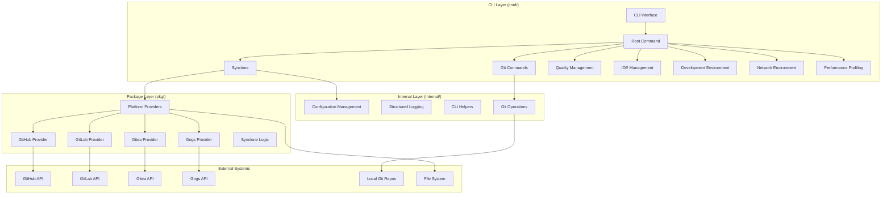

# 🏗️ System Architecture Overview

This document provides a comprehensive architectural overview of gzh-cli, including system design, components, patterns, and recent refactoring improvements.

## 📋 Table of Contents

- [High-Level Architecture](#high-level-architecture)
- [Component Overview](#component-overview)
- [Package Structure](#package-structure)
- [Design Patterns](#design-patterns)
- [Data Flow](#data-flow)
- [Recent Architectural Improvements](#recent-architectural-improvements)
- [Extension Points](#extension-points)
- [Security Architecture](#security-architecture)
- [Performance Considerations](#performance-considerations)

## 🎯 High-Level Architecture

gzh-cli follows a **simplified CLI architecture** that prioritizes developer productivity over abstract patterns, centered around direct constructors, interface-based abstractions, and modular command organization.

### Architecture Principles

1. **Interface-Driven Design** - Core abstractions through interfaces with concrete implementations
1. **Direct Constructor Pattern** - Avoid over-engineering with DI containers, use simple constructors
1. **Command-Centric Organization** - Each major feature is a top-level command with subcommands
1. **Configuration-First** - Unified YAML configuration system with schema validation
1. **Multi-Platform Support** - Abstracted platform providers for GitHub, GitLab, Gitea, Gogs

### System Layers



## 🧩 Component Overview

### 1. CLI Layer (`cmd/`)

The CLI layer provides the user interface and command-line functionality:

#### Core Commands

- **`root.go`** - Main CLI entry with all command registrations
- **`git/`** - Unified Git platform management
  - `repo_clone_or_update.go` - Smart cloning with strategies
  - `repo_list.go` - Repository listing with output formats
  - `webhook.go` - Webhook management
  - `event.go` - GitHub event processing
- **`synclone/`** - Multi-platform repository synchronization
- **`quality/`** - Multi-language code quality management
- **`repo-config/`** - Repository configuration management
- **`dev-env/`** - Development environment management
- **`net-env/`** - Network environment transitions
- **`ide/`** - JetBrains IDE monitoring
- **`pm/`** - Package manager updates
- **`profile/`** - Performance profiling (Go pprof)
- **`doctor/`** - System health diagnostics

### 2. Internal Layer (`internal/`)

Private abstractions and implementations:

#### Git Operations (`internal/git/`)

- **`interfaces.go`** - Client, StrategyExecutor, BulkOperator interfaces
- **`constructors.go`** - Concrete implementations with dependency injection
- **`operations.go`** - Git operations (clone, pull, push, reset)

#### Configuration (`internal/config/`)

- **`loader.go`** - Configuration loading with priority system
- **`validator.go`** - Schema validation and error reporting
- **`merger.go`** - Configuration merging logic

#### CLI Utilities (`internal/cli/`)

- **`output.go`** - Output formatting (table, JSON, YAML, CSV)
- **`builder.go`** - Command builder utilities
- **`flags.go`** - Common flag definitions

#### Logging (`internal/logger/`)

- **`structured.go`** - Structured logging with smart output control
- **`simple_logger.go`** - Simple terminal-friendly logging
- **`context.go`** - Context-aware logging

**Recent Improvement (2025-09)**: Enhanced logging system with intelligent output control:

- **Debug Mode Only**: Logs only appear with `--debug` flag for clean user experience
- **Performance Logs**: Simplified from JSON to readable text format
- **Console Messages**: Progress indicators and status messages remain visible

### 3. Package Layer (`pkg/`)

Public APIs and platform implementations:

#### Configuration (`pkg/config/`)

- **`schema.go`** - Configuration schema definitions
- **`types.go`** - Configuration data structures
- **`validation.go`** - Validation logic

#### Platform Providers (`pkg/github/`, `pkg/gitlab/`, `pkg/gitea/`)

- **Base Provider Pattern** - Common functionality consolidated
- **Platform-specific APIs** - Authentication, repository listing, cloning
- **Provider Registry** - Dynamic provider registration

#### Synclone (`pkg/synclone/`)

- **`engine.go`** - Multi-platform synchronization logic
- **`strategies.go`** - Clone/update strategies
- **`concurrency.go`** - Concurrent operation management
- **`progress.go`** - Advanced progress tracking with real-time updates

**Recent Improvement (2025-09)**: Enhanced progress tracking system:

- **Initial Progress Display**: Shows 0/total from start instead of jumping to middle values
- **Real-time Updates**: Progress bar updates every 500ms with accurate completion status
- **Visual Indicators**: Comprehensive status display with ✓ ✗ ⏳ symbols

## 🔄 Design Patterns

### Interface-Based Abstractions

```go
// Git operations abstraction
type Client interface {
    Clone(ctx context.Context, options CloneOptions) error
    Pull(ctx context.Context, options PullOptions) error
    Push(ctx context.Context, options PushOptions) error
}

// Configuration loading abstraction
type Loader interface {
    LoadConfig(ctx context.Context) (*Config, error)
    LoadConfigFromFile(ctx context.Context, filename string) (*Config, error)
}
```

### Provider Registry Pattern

```go
// Platform providers registered at startup
providerRegistry := provider.NewRegistry()
providerRegistry.Register("github", github.NewProvider())
providerRegistry.Register("gitlab", gitlab.NewProvider())
providerRegistry.Register("gitea", gitea.NewProvider())
```

### Strategy Pattern for Git Operations

- **rebase** - Rebase local changes on remote
- **reset** - Hard reset to match remote state
- **clone** - Fresh clone (remove existing)
- **pull** - Standard git pull (merge)
- **fetch** - Update refs only

### Base Command Pattern (Recent Improvement)

Consolidated command operations for consistency:

```go
// BaseCommand pattern for dev-env commands
type BaseCommand struct {
    name        string
    description string
    executor    CommandExecutor
}

func (bc *BaseCommand) Execute(ctx context.Context, options Options) error {
    // Common validation, logging, error handling
    return bc.executor.Execute(ctx, options)
}
```

## 📊 Data Flow Architecture

### Typical Command Execution Flow

1. **Command parsing** (Cobra) → **Flag validation**
1. **Configuration loading** (unified config system with priority)
1. **Provider factory** → **Interface implementation**
1. **Business logic execution** → **Result formatting**
1. **Output generation** (table/JSON/YAML/CSV)

### Configuration Flow

```
CLI Flags (highest priority)
    ↓
Environment Variables
    ↓
Configuration Files
    ↓
Default Values (lowest priority)
```

### Multi-Platform Sync Flow

```
User Request
    ↓
Configuration Loading
    ↓
Provider Registry Lookup
    ↓
Concurrent Platform Operations
    ↓
Strategy-Based Git Operations
    ↓
Result Aggregation & Formatting
```

## 🚀 Recent Architectural Improvements

### User Experience Enhancements (2025-09)

Latest improvements focused on user experience and interface polish:

#### Logging System Overhaul

- **Smart Output Control**: Logs only appear with `--debug` flag for clean CLI experience
- **Performance Log Format**: Converted from JSON to human-readable text format
- **Console Message Preservation**: Progress indicators (🔍, 📋, ✅) always visible

#### Progress Tracking Enhancement

- **Fixed Initial Display**: Progress bars now start from 0/total instead of jumping to middle values
- **Improved Visual Feedback**: Real-time progress updates with accurate status indicators
- **Better State Management**: Proper initialization and state loading for resumable operations

### Code Duplication Elimination (2025-08)

Major refactoring effort that achieved significant improvements:

| Component                   | Before      | After                | Improvement       |
| --------------------------- | ----------- | -------------------- | ----------------- |
| **Provider Implementation** | ~800 lines  | ~200 lines           | **75% Reduction** |
| **Dev-env Commands**        | ~2000 lines | ~400 lines           | **80% Reduction** |
| **TUI Components**          | ~600 lines  | ~150 lines + library | **75% Reduction** |
| **Config Adapters**         | ~570 lines  | ~150 lines           | **74% Reduction** |

### Key Improvements

#### 1. Provider Implementation Refactoring

- **Base Provider Pattern** - Common functionality consolidated
- **Dependency Injection** - Enhanced testability
- **90%+ duplication eliminated** across GitHub, GitLab, Gitea providers

#### 2. Command Structure Unification

- **BaseCommand Pattern** - Generic command operations
- **Template Method Pattern** - Consistent command behavior
- **Massive line reduction** in dev-env commands

#### 3. TUI Component Library

- **Theme System** - NetworkTheme and DefaultTheme
- **Component Interfaces** - Standardized component behavior
- **Backward Compatibility** - Legacy exports maintained

#### 4. Configuration System Enhancement

- **Unified Schema** - Single configuration format
- **Provider Adapters** - Platform-specific configuration handling
- **Validation Framework** - Comprehensive error reporting

## 🔌 Extension Points

### Adding New Git Platforms

1. Implement `provider.Interface` in `pkg/{platform}/`
1. Register provider in `provider.Registry`
1. Add platform-specific configuration to unified config schema
1. Implement API client with authentication
1. Add comprehensive tests with mocks

### Adding New Commands

1. Create command directory in `cmd/`
1. Implement using BaseCommand pattern if applicable
1. In `init()`, register the command with `registry.Register(newFeatureCmd{})`
1. Add configuration section to unified schema
1. Implement output formatting support

### Adding New Output Formats

All commands support multiple output formats through the `OutputFormatter`:

```go
// In command implementation
formatter := cli.NewOutputFormatter(outputFormat)
return formatter.FormatOutput(results)
```

Supported formats: `table`, `json`, `yaml`, `csv`, `html` (select commands)

## 🔒 Security Architecture

### Authentication Management

- **Token-based authentication** for all Git platforms
- **Environment variable expansion** with `${TOKEN}` syntax
- **No token logging** - Sensitive data protection
- **Token validation** before API calls

### Configuration Security

- **File permissions** - Restricted access to config files
- **Schema validation** - Prevent injection attacks
- **Input sanitization** - All user inputs validated

### Network Security

- **HTTPS-only** API communication
- **Proxy support** - Corporate network compatibility
- **Rate limiting** - Respect API rate limits
- **Timeout handling** - Prevent hanging operations

## ⚡ Performance Considerations

### Concurrency Patterns

- **Worker pools** for bulk operations
- **Configurable concurrency** - Adjust for system resources
- **Graceful shutdown** - Context cancellation support
- **API rate limiting** - Adaptive rate limiting

### Memory Management

- **Streaming operations** - Large datasets handled efficiently
- **Buffered I/O** - File operations optimized
- **Resource cleanup** - Proper resource management with defer

### Caching Strategy

- **Configuration caching** - Avoid repeated parsing
- **API response caching** - Reduce network calls
- **Git operation optimization** - Smart update strategies

## 📊 Testing Architecture

### Test Organization

- **Unit tests** - `*_test.go` files alongside source
- **Integration tests** - `test/integration/` with Docker containers
- **E2E tests** - `test/e2e/` with real CLI execution
- **Mocking** - Generated mocks with `gomock` for interfaces

### Test Categories

```bash
make test-unit          # Fast unit tests
make test-integration   # Docker-based integration tests
make test-e2e           # End-to-end CLI tests
make test-all           # Complete test suite
```

### Mock Generation

Interfaces are marked with `//go:generate mockgen` directives:

```go
//go:generate mockgen -source=interfaces.go -destination=mocks/mock_client.go
type Client interface {
    Clone(ctx context.Context, options CloneOptions) error
}
```

## 📈 Metrics and Monitoring

### Performance Monitoring

- **Built-in profiling** - Go pprof integration
- **Command timing** - Execution time tracking
- **Memory usage** - Memory allocation monitoring
- **Concurrency metrics** - Worker pool utilization

### Operational Metrics

- **Success/failure rates** - Operation outcome tracking
- **API call metrics** - Platform API usage
- **Error categorization** - Error type classification
- **User behavior** - Command usage patterns

______________________________________________________________________

**Architecture Version**: 2.1 (UX Enhancements)
**Last Updated**: 2025-09-02
**Major Refactoring**: 2025-08 (75%+ code reduction)
**Latest Improvements**: 2025-09 (Logging & Progress UX)
**Design Philosophy**: Simple, Interface-Driven, Performance-Focused, User-Centric
