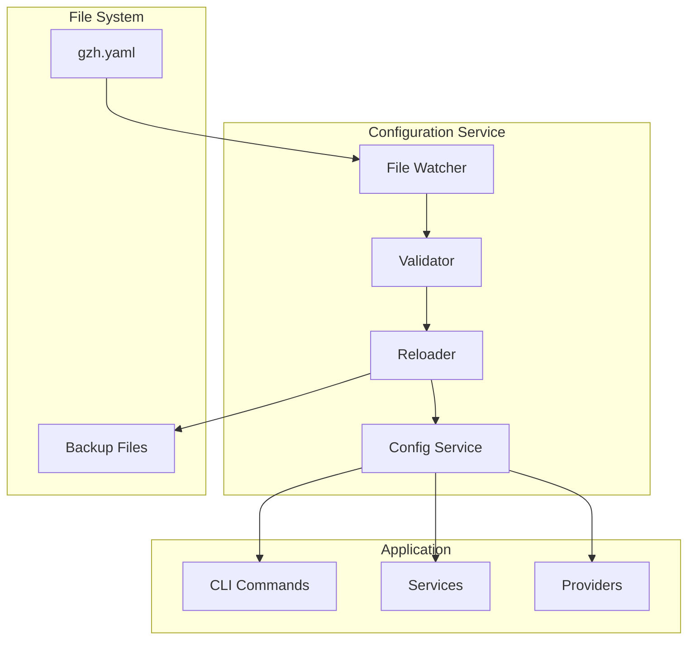

# 🔧 Advanced Configuration Features

This document covers advanced configuration capabilities including hot-reloading, validation, schema management, and performance optimization.

## 📋 Table of Contents

- [Configuration Hot-Reloading](#configuration-hot-reloading)
- [Schema Validation](#schema-validation)
- [Configuration Performance](#configuration-performance)
- [Multi-Environment Management](#multi-environment-management)
- [Configuration Security](#configuration-security)
- [Debugging and Troubleshooting](#debugging-and-troubleshooting)

## 🔄 Configuration Hot-Reloading

### Overview

Configuration hot-reloading allows gzh-cli to automatically detect and reload configuration file changes without requiring a restart. This feature is particularly useful during development and in dynamic environments.

### Enabling Hot-Reloading

```yaml
# Enable hot-reloading in configuration
global:
  hot_reload:
    enabled: true
    watch_interval: "1s"
    validation_on_reload: true
    backup_on_change: true

  # File watching settings
  file_watching:
    recursive: true
    include_patterns:
      - "*.yaml"
      - "*.yml"
    exclude_patterns:
      - "*.backup.*"
      - "*.tmp"
```

### Hot-Reload Commands

```bash
# Enable hot-reloading for current session
gz config watch --enable

# Monitor configuration changes
gz config watch --monitor

# Manual reload configuration
gz config reload

# Test hot-reload functionality
gz config watch --test
```

### Hot-Reload Architecture



### Hot-Reload Process

1. **File Detection** - Monitor configuration file for changes
2. **Validation** - Validate new configuration before applying
3. **Backup** - Create backup of previous working configuration
4. **Reload** - Apply new configuration to running services
5. **Notification** - Notify components of configuration changes

### Configuration Watching

```bash
# Start configuration watcher
gz config watch --daemon

# Watch with verbose logging
gz config watch --verbose

# Watch specific files
gz config watch --files config1.yaml,config2.yaml

# Watch with callback script
gz config watch --on-change "./scripts/config-changed.sh"
```

## 🔍 Schema Validation

### Schema Management

```bash
# Show current schema
gz config schema

# Validate against schema
gz config validate --schema

# Export schema to file
gz config schema --output schema.json

# Generate schema from configuration
gz config generate-schema --input gzh.yaml --output custom-schema.json
```

### Custom Schema Validation

```yaml
# Custom validation rules
validation:
  # Schema file location
  schema_file: ".gzh-schema.json"

  # Validation levels
  validation_level: strict  # strict, warn, off

  # Custom rules
  custom_rules:
    - name: "required-github-token"
      condition: "providers.github.token != ''"
      message: "GitHub token is required"
      severity: error

    - name: "max-concurrent-jobs"
      condition: "global.concurrent_jobs <= 20"
      message: "Too many concurrent jobs may overwhelm the system"
      severity: warning

    - name: "secure-clone-directory"
      condition: "!global.clone_base_dir.startsWith('/tmp')"
      message: "Clone directory should not be in /tmp"
      severity: info
```

### Schema Generation

```bash
# Generate schema from existing configurations
gz config schema generate --input-dir ~/.config/gzh-manager/

# Merge multiple schemas
gz config schema merge --schemas schema1.json,schema2.json --output merged.json

# Validate schema compatibility
gz config schema validate --schema custom-schema.json
```

## ⚡ Configuration Performance

### Performance Optimization

```yaml
global:
  # Performance settings
  performance:
    # Configuration caching
    cache_config: true
    cache_ttl: "5m"

    # Lazy loading
    lazy_load_providers: true
    lazy_load_commands: true

    # Memory optimization
    max_config_size: "10MB"
    compress_config: true

    # Parallel processing
    parallel_validation: true
    parallel_loading: true
```

### Configuration Caching

```bash
# Enable configuration caching
gz config cache --enable

# Clear configuration cache
gz config cache --clear

# Show cache statistics
gz config cache --stats

# Configure cache settings
gz config cache --ttl 10m --max-size 50MB
```

### Performance Monitoring

```bash
# Monitor configuration performance
gz config perf monitor

# Profile configuration loading
gz config perf profile --output config-profile.json

# Benchmark configuration operations
gz config perf benchmark --iterations 100
```

## 🌍 Multi-Environment Management

### Environment-Specific Configurations

```yaml
# Base configuration
base_config: &base
  global:
    log_level: info
    concurrent_jobs: 5

# Development environment
development:
  <<: *base
  global:
    log_level: debug
    clone_base_dir: "$HOME/dev/repos"

  providers:
    github:
      token: "${DEV_GITHUB_TOKEN}"
      organizations:
        - name: "dev-org"

# Production environment
production:
  <<: *base
  global:
    log_level: warn
    clone_base_dir: "/opt/repos"
    concurrent_jobs: 10

  providers:
    github:
      token: "${PROD_GITHUB_TOKEN}"
      organizations:
        - name: "prod-org"
```

### Environment Switching

```bash
# Use specific environment
gz config env use development

# List available environments
gz config env list

# Create new environment
gz config env create staging --from development

# Export environment configuration
gz config env export production --output prod-config.yaml
```

### Configuration Profiles

```bash
# Create configuration profile
gz config profile create work --providers github,gitlab

# Apply configuration profile
gz config profile apply work

# List available profiles
gz config profile list

# Share configuration profile
gz config profile export work --output work-profile.yaml
```

## 🔐 Configuration Security

### Secure Configuration Management

```yaml
security:
  # Encryption settings
  encryption:
    enabled: true
    algorithm: "AES-256-GCM"
    key_file: "$HOME/.config/gzh-manager/encryption.key"

  # Access control
  access_control:
    file_permissions: "600"
    directory_permissions: "700"
    require_owner: true

  # Sensitive data handling
  sensitive_fields:
    - "providers.*.token"
    - "providers.*.password"
    - "auth.credentials"

  # Audit logging
  audit:
    enabled: true
    log_file: "$HOME/.config/gzh-manager/audit.log"
    log_changes: true
    log_access: true
```

### Encryption and Secrets

```bash
# Encrypt configuration
gz config encrypt --input gzh.yaml --output gzh-encrypted.yaml

# Decrypt configuration
gz config decrypt --input gzh-encrypted.yaml --output gzh.yaml

# Manage encryption keys
gz config keys generate --output encryption.key
gz config keys rotate --current-key old.key --new-key new.key

# Secret management
gz config secrets set GITHUB_TOKEN --from-env
gz config secrets set GITLAB_TOKEN --from-stdin
gz config secrets list --masked
```

### Configuration Auditing

```bash
# Enable configuration auditing
gz config audit --enable

# Show audit log
gz config audit log

# Audit configuration changes
gz config audit changes --since "24h ago"

# Export audit report
gz config audit report --output audit-report.json
```

## 🐛 Debugging and Troubleshooting

### Configuration Debugging

```bash
# Debug configuration loading
gz config debug --trace-loading

# Show configuration resolution
gz config debug --show-resolution

# Validate configuration step by step
gz config debug --validate-steps

# Test configuration without applying
gz config debug --dry-run
```

### Configuration Diagnostics

```bash
# Run configuration diagnostics
gz config diagnose

# Check configuration health
gz config health

# Verify configuration integrity
gz config verify --checksum

# Fix common configuration issues
gz config fix --auto
```

### Advanced Debugging

```yaml
debugging:
  # Debug settings
  enable_debug_mode: true
  debug_output_file: "$HOME/.config/gzh-manager/debug.log"

  # Trace settings
  trace_config_loading: true
  trace_provider_resolution: true
  trace_command_execution: true

  # Performance debugging
  profile_config_ops: true
  log_performance_metrics: true

  # Validation debugging
  detailed_validation_errors: true
  show_validation_context: true
```

### Configuration Testing

```bash
# Test configuration syntax
gz config test syntax

# Test configuration logic
gz config test logic

# Test provider connectivity
gz config test connectivity

# Integration testing
gz config test integration --providers github,gitlab

# Load testing
gz config test load --concurrent 10 --duration 60s
```

## 📊 Configuration Analytics

### Usage Analytics

```bash
# Show configuration usage statistics
gz config analytics usage

# Track configuration performance
gz config analytics performance

# Monitor configuration changes
gz config analytics changes --period 30d

# Export analytics data
gz config analytics export --format csv
```

### Configuration Metrics

```yaml
metrics:
  # Enable metrics collection
  enabled: true

  # Metrics endpoints
  prometheus:
    enabled: true
    port: 9090
    path: "/metrics"

  # Custom metrics
  custom_metrics:
    - name: "config_reload_duration"
      type: "histogram"
      help: "Time taken to reload configuration"

    - name: "provider_auth_attempts"
      type: "counter"
      help: "Number of provider authentication attempts"
```

## 🔄 Configuration Migration

### Migration Tools

```bash
# Migrate from old configuration format
gz config migrate --from-version 0.9 --to-version 1.0

# Convert between formats
gz config convert --from yaml --to json --input gzh.yaml

# Upgrade configuration schema
gz config upgrade --schema-version 2.0

# Backup before migration
gz config migrate --backup --backup-dir backups/
```

### Migration Scripts

```bash
# Create migration script
gz config migration create --name "add-new-provider" --template

# Run migration
gz config migration run --name "add-new-provider"

# Rollback migration
gz config migration rollback --name "add-new-provider"

# List migration history
gz config migration history
```

---

**Hot-Reload**: Real-time configuration updates without restart
**Schema Validation**: Comprehensive configuration validation
**Security**: Encryption, access control, audit logging
**Performance**: Caching, lazy loading, optimization
**Multi-Environment**: Development, staging, production configurations
