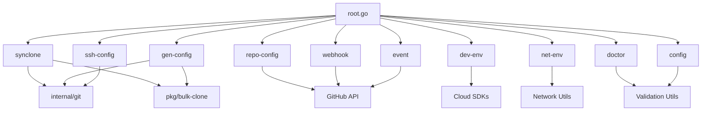

# Command Dependency Map

## Package Dependencies by Command

### 1. synclone
- **Internal packages**: 
  - `pkg/bulk-clone/` - Core cloning logic
  - `pkg/github/` - GitHub API integration
  - `pkg/gitlab/` - GitLab API integration
  - `pkg/gitea/` - Gitea API integration
  - `internal/git/` - Git operations
  - `internal/convert/` - Data conversion utilities

### 2. gen-config
- **Internal packages**:
  - `pkg/gen-config/` - Configuration generation logic
  - `internal/git/` - Git repository scanning
  - Likely shares bulk-clone configuration schemas

### 3. repo-config
- **Internal packages**:
  - GitHub API integration (needs verification)
  - Configuration management utilities

### 4. event
- **Internal packages**:
  - GitHub webhook handling
  - Event processing logic

### 5. webhook
- **Internal packages**:
  - GitHub API for webhook management
  - HTTP server components

### 6. ssh-config
- **Internal packages**:
  - SSH key management
  - Git service configuration

### 7. dev-env
- **Internal packages**:
  - Cloud provider SDKs (AWS, GCP, Azure)
  - Kubernetes client
  - Docker client
  - Configuration management

### 8. net-env
- **Internal packages**:
  - Network configuration utilities
  - VPN management
  - DNS configuration
  - Proxy settings

### 9. doctor
- **Internal packages**:
  - System validation utilities
  - Dependency checking
  - Configuration validation

### 10. config
- **Internal packages**:
  - Generic configuration management
  - YAML/JSON parsing

## Shared Dependencies

### Common Utilities
- `internal/logger/` - Used by all commands
- `internal/convert/` - Data conversion (synclone, gen-config)
- `internal/git/` - Git operations (synclone, gen-config, ssh-config)

### Configuration Management
- YAML parsing - Used by most commands
- Environment variable handling - Global
- File I/O utilities - Global

### External Dependencies
- `github.com/spf13/cobra` - All commands
- `github.com/spf13/viper` - Configuration commands
- GitHub API clients - repo-config, webhook, event
- Cloud SDKs - dev-env

## Dependency Relationships

## Consolidation Opportunities Based on Dependencies

### 1. GitHub Integration Group
- **Commands**: repo-config, webhook, event
- **Shared**: GitHub API, webhook handling
- **Target**: Consolidate into `repo-sync`

### 2. Configuration Group
- **Commands**: config, gen-config
- **Shared**: Configuration schemas, YAML parsing
- **Target**: Merge gen-config into synclone

### 3. Environment Group
- **Commands**: dev-env, ssh-config
- **Shared**: Development environment setup
- **Target**: Merge ssh-config into dev-env

### 4. Validation Group
- **Commands**: doctor, various validate subcommands
- **Shared**: Validation utilities
- **Target**: Distribute to each command's validate subcommand

## Dependency Conflicts to Resolve

1. **Circular Dependencies**: None detected
2. **Version Conflicts**: Need to verify GitHub API client versions
3. **Duplicate Utilities**: Configuration parsing might be duplicated